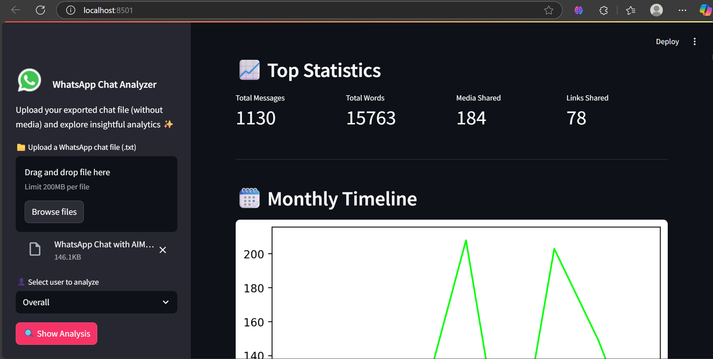

[]
[]
[]
[]

# 📊 DataScience-Project-Whatsapp-Chat-Analyzer



This project provides a comprehensive analysis of a WhatsApp chat exported from any group or individual conversation. Built using Python, Pandas, and Streamlit, it offers insightful visualizations and metrics such as:

- Total messages
- Word count
- Media files shared
- Links shared
- Most active users
- Timeline of activity (monthly/daily)
- Emoji usage
- Most common words

---

## 🚀 Demo


---

## 🛠️ Features
- Upload WhatsApp chat `.txt` file (without media)
- Dynamic user selection to view stats individually or overall
- Intuitive visualizations and statistics
- Emoji and word frequency distribution

---

## 📂 How to Export WhatsApp Chat
1. Open the WhatsApp chat (group or personal).
2. Tap on the three-dot menu (top-right).
3. Select `More` > `Export chat`.
4. Choose `Without Media`.
5. Save or send the `.txt` file to your computer.

---

## 🧰 Tech Stack
- Python 🐍
- Pandas 📊
- Streamlit 🌐
- Matplotlib / Seaborn 📈

---

## 📦 Installation
```bash
# Clone the repository
git clone https://github.com/IbrahimBagwan1/DataScience-Project-Whatsapp-Chat-Analyzer.git
cd DataScience-Project-Whatsapp-Chat-Analyzer

# Create virtual environment (optional but recommended)
python -m venv env
source env/bin/activate  # On Windows: env\Scripts\activate

# Install dependencies
pip install -r requirements.txt

# Run the Streamlit app
streamlit run app.py
```

---

## 📋 Usage
1. Launch the app via `streamlit run app.py`
2. Upload the exported WhatsApp chat `.txt` file
3. Click on "Show Analysis" to view full chat insights

---

## 📁 File Structure
```
├── app.py                  # Streamlit UI
├── helper.py              # Helper functions (stats, emoji, etc.)
├── preprocessor.py        # Chat parsing logic
├── requirements.txt       # Dependencies
├── stop_hinglish.txt      # Stop words (optional)
├── README.md              # Project overview
```

---

## 📈 Example Insights
- **Most Active Day**
- **Most Active User**
- **Monthly & Daily Timeline**
- **Most Used Emojis**
- **Most Common Words (excluding stopwords)**

---

## 👤 Author
**Ibrahim Bagwan**  
GitHub: [@IbrahimBagwan1](https://github.com/IbrahimBagwan1)

---

## 🌐 Project Link
🔗 [DataScience-Project-Whatsapp-Chat-Analyzer](https://github.com/IbrahimBagwan1/DataScience-Project-Whatsapp-Chat-Analyzer)

---

## 📝 License
This project is licensed under the MIT License - see the [LICENSE](LICENSE) file for details.

---

## 🙌 Contributions
Feel free to fork the repo and submit pull requests to enhance features, performance, or design!
